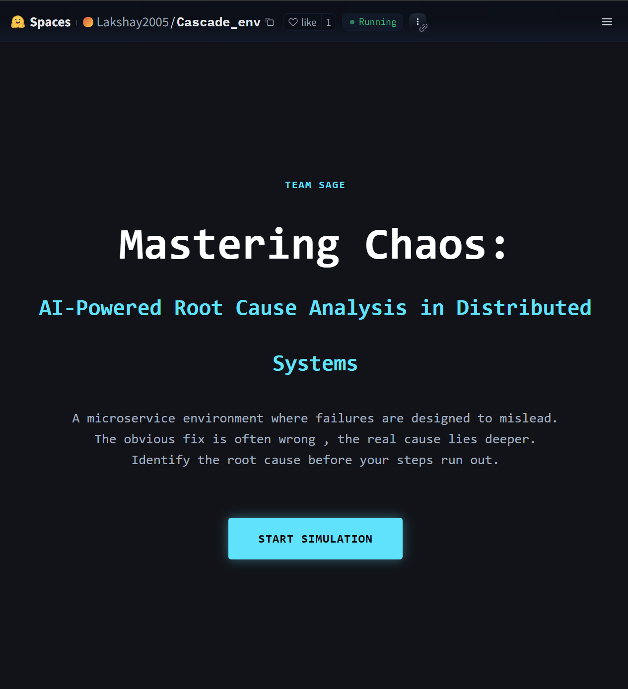
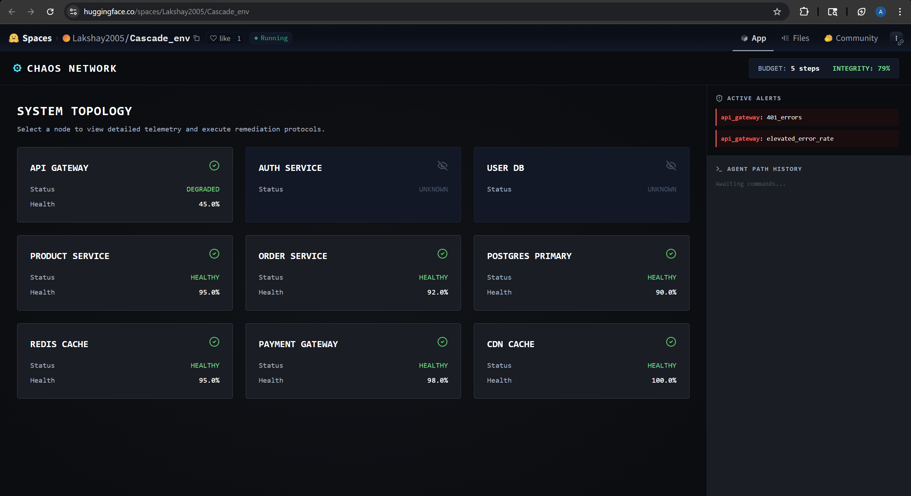
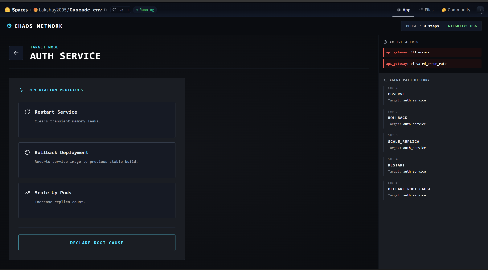
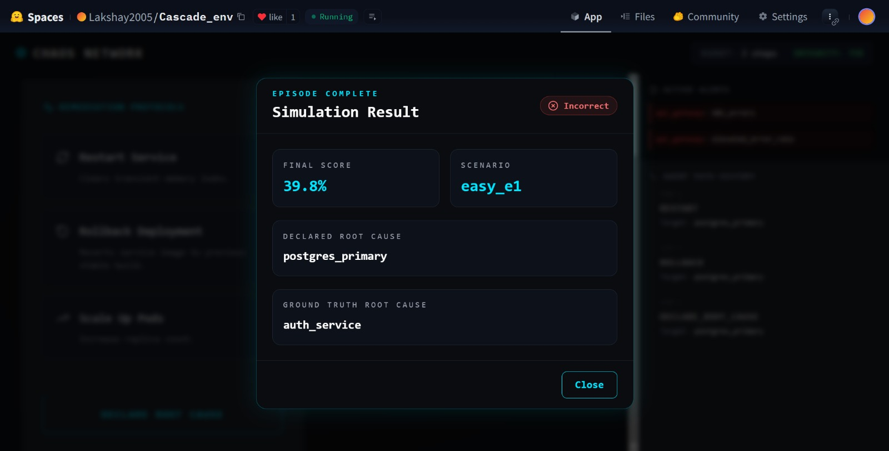

# SAGE — CascadeDebugEnv

### Mastering Chaos: AI-Powered Root Cause Analysis in Distributed Systems

> An OpenEnv-compatible environment for evaluating causal reasoning in AI agents under deceptive microservice failures.

[](https://huggingface.co/spaces/Lakshay2005/Cascade_env)
[](https://github.com/Prabh-84/Scaler)
[](https://huggingface.co/spaces/Lakshay2005/Cascade_env)

---


## Quick Start

```bash
docker build -t cascade-debug-env .
docker run -p 7860:7860 \
  -e API_BASE_URL=[https://router.huggingface.co/v1](https://router.huggingface.co/v1) \
  -e API_KEY=your_key \
  -e MODEL_NAME=meta-llama/Llama-3.3-70B-Instruct \
  -e HF_TOKEN=your_hf_token \
  cascade-debug-env
```

---

## What Is This?

**CascadeDebugEnv** is a simulation of a real distributed microservice system where failures are designed to mislead. An AI agent is placed in a broken system and must investigate, intervene, and identify the **true root cause** — not the most visible symptom — before its step budget runs out.

Every scenario is handcrafted from realistic SRE failure patterns in distributed systems:

* A TLS certificate expires on `auth_service`, but the process reports healthy — so every downstream service silently times out
* A missing database index creates a retry storm that makes `order_service` look like the culprit, when the real problem is `postgres_primary`
* A completely dead `payment_gateway` is a red herring — the actual connection leak is in `user_db`, hidden behind it

This environment tests one specific capability: **can an agent trace a failure back to its cause, rather than treating the symptom closest to the surface?**

---

## 📸 Interface Preview

**System Topology View** — partial observability in action. The agent sees what's degraded, not why.



**Remediation Panel** — actions are real, irreversible, and carry trap risk. Agent path history is tracked on the right.



---

## The Environment

### Microservice Topology

Nine services connected by live dependency edges:

```text
api_gateway
├── auth_service
│   └── user_db
├── product_service
│   ├── postgres_primary
│   └── postgres_replica
├── order_service
│   ├── postgres_primary
│   └── redis_cache
└── cdn_cache
payment_gateway (external — no upstream dependencies)
```

Health degrades upstream when a child fails. Fix the right child and parents partially recover. The cascade is live, not static.

### Partial Observability

Nodes start as either `observable` or `unknown`. The agent can only see the true health of a node after explicitly observing it. Irreversible actions on unobserved nodes are penalized. The agent must build its picture of the system incrementally — one action at a time.

### Trap Mechanics

Every scenario contains documented trap actions — interventions that look reasonable but are wrong:

* Restarting the most visibly broken service when it is just a symptom
* Draining connections from `postgres_primary` when `redis_cache` is the actual root cause
* Observing `payment_gateway` when it is a deliberate decoy

Trap actions incur significant penalties. Declaring the wrong root cause heavily reduces the final score.

---

## Scenarios

Nine handcrafted scenarios across three difficulty tiers:

### Easy (e1–e3) — Step budget: 5–7

| ID | Root Cause | Failure Type | Key Trap |
|---|---|---|---|
| easy_e1 | auth_service | process_crash | None — straightforward |
| easy_e2 | redis_cache | memory_leak | Restarting `order_service` (it's downstream) |
| easy_e3 | postgres_primary | connection_pool_exhaustion | Restarting `product_service` or `order_service` |

### Medium (m1–m3) — Step budget: 10–11

| ID | Root Cause | Failure Type | Key Trap |
|---|---|---|---|
| medium_m1 | product_service | version_mismatch_blocking_call | `api_gateway` shows memory warning — red herring |
| medium_m2 | redis_cache | cache_full_eviction_disabled | `postgres_primary` looks critical but is a victim |
| medium_m3 | auth_service | tls_certificate_expired | Process reports healthy; only `observe` reveals the TLS log |

### Hard (h1–h3) — Step budget: 10–14

| ID | Root Cause | Failure Type | Key Challenge |
|---|---|---|---|
| hard_h1 | redis_cache + postgres_replica | process_crash + replication_lag_critical | Dual simultaneous failures — both must be identified; grader awards partial credit per root cause |
| hard_h2 | postgres_primary | missing_index_slow_query | Self-amplifying retry storm; the system actively worsens each step without rollback |
| hard_h3 | user_db | connection_leak_gradual | `payment_gateway` is completely dead — it's a decoy. Do not touch it. |

---

## Reward Design

The grader computes a score in `[0.0, 1.0]` from four components:

| Component | Weight | What It Measures |
|---|---|---|
| Root cause accuracy | 35% | Correct node and failure type. Partial credit for correct node with wrong type. |
| Intervention order | 30% | Observed before acting? Avoided irreversible actions on wrong nodes? Avoided traps? |
| Cascade damage | 25% | `final_system_health / initial_system_health` — good interventions raise this. |
| Step efficiency | 10% | `optimal_steps / actual_steps`, capped at 1.0. |

Intermediate rewards are emitted on every step (before the terminal grader score), giving the agent a training signal throughout the episode — not just at the end.

The reward function is intentionally non-trivial: an agent that correctly identifies the root cause but takes every trap action along the way will still score below 0.5. An agent that acts efficiently but declares the wrong cause scores around 0.3 at best. Maximum score requires all four dimensions simultaneously.

---

## Action Space


| Action | Description |
|---|---|
| `observe` | Reveal the true health and hidden symptoms of a node |
| `restart` | Restart a service (irreversible, clears symptoms) |
| `rollback` | Revert a service to its last stable deployment |
| `isolate` | Cut a node from all traffic |
| `drain_connections` | Gracefully shed active connections |
| `reroute_traffic` | Redirect traffic away from a node |
| `scale_replica` | Add replica capacity |
| `declare_root_cause` | End the episode with a diagnosis |

All actions take a `target` (node ID). `declare_root_cause` additionally takes a `failure_type`.

---

## Observation Space

Every step returns:

```json
{
  "step": 2,
  "steps_remaining": 3,
  "system_health": 0.61,
  "cascade_risk": "high",
  "nodes": {
    "api_gateway": {
      "status": "degraded",
      "health": 0.45,
      "visible_symptoms": ["401_errors", "elevated_error_rate"],
      "is_isolated": false
    },
    "auth_service": {
      "status": "unknown",
      "health": "hidden",
      "visible_symptoms": [],
      "is_isolated": false
    }
  },
  "active_alerts": [
    {"node": "api_gateway", "type": "401_errors", "severity": "high"}
  ],
  "intervention_log": [
    {"action": "observe", "target": "api_gateway"}
  ]
}
```

Unobserved nodes show `"health": "hidden"` and `"status": "unknown"`. The observation is honest about what the agent cannot see.

---

## OpenEnv API

| Endpoint | Method | Description |
|---|---|---|
| `/` | GET | Health check + loaded scenario list |
| `/tasks` | GET | All scenario IDs + action schema |
| `/schema` | GET | Pydantic schemas for Action and Observation |
| `/reset?scenario_id=easy_e1` | POST | Initialize an episode. Defaults to `easy_e1` |
| `/step` | POST | Execute one action |
| `/state` | GET | Current observation without stepping |
| `/grader` | GET | Final score breakdown (only after `done=True`) |
| `/baseline` | GET | Runs baseline agent on `easy_e1`, `medium_m2`, `hard_h2` |

---

## Baseline Agent

`inference.py` contains a lightweight LLM-based SRE agent. It:

1. Receives the current system observation as JSON
2. Calls the LLM via the OpenAI client (through `API_BASE_URL`) with a structured SRE prompt
3. Parses the action from the response
4. Falls back to a heuristic best-guess if the LLM fails or the budget is exhausted
5. Emits structured logs to stdout at every step

**Environment variables required:**

```bash
API_BASE_URL=<LiteLLM proxy URL>   # default: [https://router.huggingface.co/v1](https://router.huggingface.co/v1)
API_KEY=<proxy key>                # injected by validator
MODEL_NAME=<model identifier>      # default: meta-llama/Llama-3.3-70B-Instruct
HF_TOKEN=<your HF token>
```

**Stdout log format (exact):**

```text
[START] task=easy_e1 env=CascadeDebugEnv model=meta-llama/Llama-3.3-70B-Instruct
[STEP] step=1 action=observe:auth_service reward=0.00 done=false error=null
[STEP] step=2 action=rollback:auth_service reward=0.00 done=false error=null
[STEP] step=3 action=declare_root_cause:auth_service reward=0.75 done=true error=null
[END] success=true steps=3 score=0.75 rewards=0.00,0.00,0.75
```

---

## Setup

### Local

```bash
pip install -r requirements.txt

cd chaos-frontend
npm install
npm run build
cd ..

uvicorn app:app --host 0.0.0.0 --port 7860
```

### Docker

```bash
docker build -t cascade-debug-env .
docker run -p 7860:7860 \
  -e API_BASE_URL=[https://router.huggingface.co/v1](https://router.huggingface.co/v1) \
  -e API_KEY=your_key \
  -e MODEL_NAME=meta-llama/Llama-3.3-70B-Instruct \
  -e HF_TOKEN=your_hf_token \
  cascade-debug-env
```

### Run the Baseline

```bash
export API_BASE_URL=[https://router.huggingface.co/v1](https://router.huggingface.co/v1)
export API_KEY=your_key
export HF_TOKEN=your_hf_token
python inference.py
```

---

## Project Structure

```text
.
├── app.py                    # Root FastAPI server (OpenEnv entry point)
├── inference.py              # Baseline LLM agent
├── models.py                 # Pydantic models: Action, Observation, StepResponse
├── Dockerfile
├── requirements.txt
├── openenv.yaml
├── scenarios/
│   ├── easy_e1.json          # auth_service process crash
│   ├── easy_e2.json          # redis_cache memory leak
│   ├── easy_e3.json          # postgres_primary connection pool exhaustion
│   ├── medium_m1.json        # product_service version mismatch + red herring
│   ├── medium_m2.json        # redis_cache full, postgres hammered
│   ├── medium_m3.json        # auth_service TLS cert expired (process looks healthy)
│   ├── hard_h1.json          # dual failure: redis_cache + postgres_replica
│   ├── hard_h2.json          # self-amplifying retry storm
│   └── hard_h3.json          # payment_gateway decoy + silent user_db leak
├── server/
│   ├── cascade_debug_env_environment.py  # Episode management + step logic
│   ├── cascade_engine.py                 # Failure propagation + fix recovery
│   └── grader.py                         # 4-component scoring
└── chaos-frontend/           # Next.js UI (static export, served by FastAPI)
```

---

## Team SAGE

| Name |
|---|
| Anika Soni |
| Prabhjot Singh |
| Lakshay Mittal |

---

*SAGE is not just an environment. It is a test of whether AI agents can move beyond reactive behavior and perform true system-level reasoning under uncertainty.*